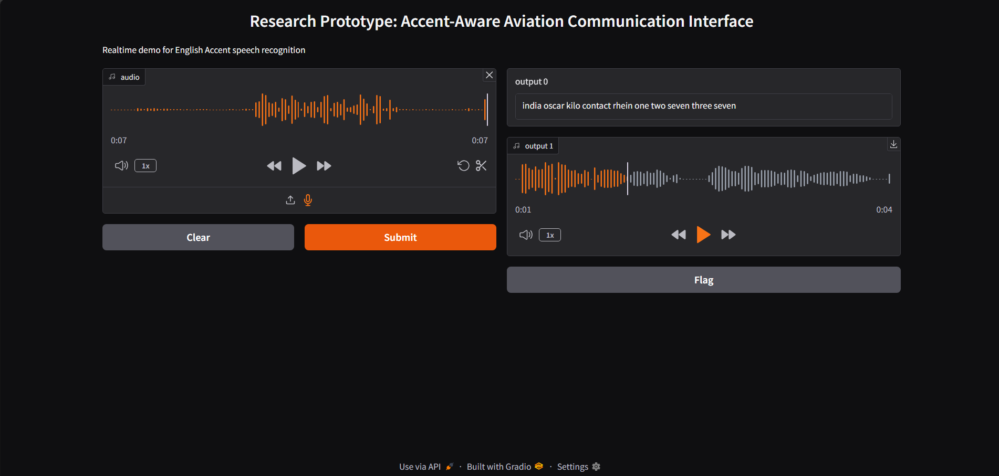

# Enhancing Aviation Communication: A Machine Learning Approach to Mitigate Accent-Induced Miscommunication

**Authors:** Sanjana Dubey
**Emails:** dubeysanjana23@gmail.com

---

## 🛫 Project Overview

Accent-induced miscommunication between pilots and air traffic controllers (ATCs) poses a significant risk to aviation safety. This repository presents a machine learning-based solution designed to mitigate such challenges by enhancing speech recognition across diverse accents in aviation communication.

Our model leverages **Mozilla’s Common Voice dataset** for broad accent recognition and is fine-tuned using **real-world ATC conversation data** to better understand aviation-specific terminology. A **Gradio-based interface** is provided for easy interaction and demonstration.

---

## 📌 Abstract

Accent-induced miscommunication between pilots and air traffic controllers is one of the most significant threats to aviation safety. This work proposes a machine learning model to improve communication accuracy by addressing accent-related challenges. The model uses Mozilla's Common Voice dataset for broad accent recognition and is fine-tuned with real-world ATC data to enhance understanding of aviation-specific language. This approach targets both accent misinterpretation and critical air traffic exchanges, offering the potential to significantly reduce communication errors and improve aviation safety.

---

## 🧠 Introduction

Aviation relies heavily on precise communication between pilots and air traffic controllers to ensure safety and efficiency. However, due to the global nature of aviation, accent diversity often leads to miscommunication. While English is the mandated international language for aviation, the variations in pronunciation, dialect, and comprehension still pose critical challenges.

This project focuses on leveraging **Automatic Speech Recognition (ASR)** and **machine learning** to build an accent-robust speech-to-text system. By training on large-scale multilingual data and fine-tuning on aviation-specific audio, we aim to reduce ambiguity and increase the reliability of air-to-ground communication.

---

## 🛠️ Technologies Used

- **Model:** [Whisper Large](https://openai.com/research/whisper) (Fine-tuned)
- **Dataset:** Mozilla Common Voice + ATC-specific audio
- **Interface:** Gradio
- **Language:** Python
- **Notebook Environment:** Google Colab

---

## 🎯 Key Features

- Fine-tuned Whisper model to understand diverse accents.
- Focus on aviation terminology and phraseology.
- Real-time speech-to-text conversion via Gradio interface.
- Designed to assist in reducing ATC communication errors.

---

## 📷 Gradio Interface

Below is a screenshot of the deployed Gradio interface that demonstrates real-time transcription from audio input:

---

